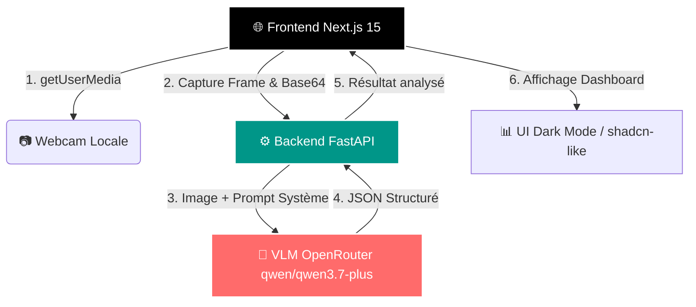

# 🚀 Oxymis Vision


> **Projet réalisé par Joshua Deschietere**  
> Dans le cadre du cours de **Gestion et Management de Projet Intelligent**  
> 🎓 **IMT Nord Europe** | Promotion **FISA ITR 27**  
> 👥 **Groupe 6** : Joshua / Louis / Macéo / Axel

---

## 📖 Concept

**Oxymis Vision** est une application web démonstrateur des capacités de compréhension d'environnement d'une IA (VLM) appliquée à la domotique et à la sécurité. 

L'application utilise la webcam locale pour capturer une image, l'envoie à un backend sécurisé qui l'analyse via un modèle de vision par ordinateur (OpenRouter), et affiche les résultats structurés sur un dashboard moderne en temps réel.

---

## 🏗️ Architecture

Le projet est 100% conteneurisé via Docker Compose pour un déploiement reproductible et isolé.



### 🔍 Capacités d'analyse du VLM
Le prompt système force le modèle à retourner un JSON strict contenant :
- 🚨 **État de santé/Urgence** : Détection de personne inconsciente (Oui/Non/Incertain).
- 👤 **Présence** : Présent / Non présent.
- 🏃 **Description d'activité** : Analyse courte du comportement.
- 🏠 **Contexte Domotique** : Identification d'objets connectés et proposition de scénario d'automatisation.

---

## 🛠️ Installation & Démarrage

### Prérequis
- [Docker](https://www.docker.com/) & [Docker Compose](https://docs.docker.com/compose/) installés sur votre machine.

### Configuration
1. Clonez le dépôt :
   ```bash
   git clone https://github.com/JoshuaDsDl/Oxymis-Vision.git
   cd Oxymis-Vision
   ```
2. Copiez le fichier d'exemple d'environnement et ajoutez votre clé API OpenRouter :
   ```bash
   cp .env.example .env
   ```
3. Éditez le fichier `.env` pour y insérer votre clé :
   ```env
   OPENROUTER_API_KEY=sk-or-v1-votre_cle_api_ici
   ```

### Lancement
Démarrez l'ensemble des services en arrière-plan :
```bash
docker-compose up -d --build
```

L'application est alors accessible aux adresses suivantes :
- 🖥️ **Frontend** : [http://localhost:3000](http://localhost:3000)
- ⚙️ **Backend API** : [http://localhost:8000](http://localhost:8000)
- 📚 **Swagger Docs** : [http://localhost:8000/docs](http://localhost:8000/docs)

---

## 🧪 Tests & Validation

Le projet intègre des validations de bout en bout :
- Vérification de la santé du backend (`/health`).
- Tests d'intégration du flux webcam -> capture -> envoi base64 -> réponse JSON.
- Gestion robuste des erreurs CORS et des timeouts.

---

## 📂 Structure du Projet

```text
Oxymis-Vision/
├── backend/
│   ├── Dockerfile
│   ├── main.py               # Application FastAPI & logique VLM
│   └── requirements.txt      # Dépendances Python
├── frontend/
│   ├── Dockerfile
│   ├── app/
│   │   ├── globals.css       # Styles Tailwind (Dark mode)
│   │   ├── layout.tsx        # Layout racine Next.js
│   │   └── page.tsx          # Composant principal (Webcam + Dashboard)
│   ├── next.config.js
│   ├── package.json
│   ├── tailwind.config.js
│   └── tsconfig.json
├── docker-compose.yml        # Orchestration des conteneurs
├── .env.example              # Modèle de variables d'environnement
└── README.md                 # Ce fichier
```

---

## ⚠️ Sécurité

- **Ne commitez jamais** votre fichier `.env` contenant la clé API.
- Le fichier `.gitignore` est configuré pour exclure automatiquement les secrets et les dossiers de build.
- Le backend valide strictement le format des données reçues et limite les origines via CORS.

---

## 📜 Licence

Projet réalisé dans un cadre académique. Usage libre à des fins de démonstration et d'apprentissage.